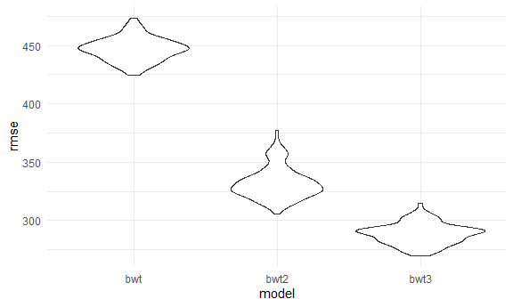
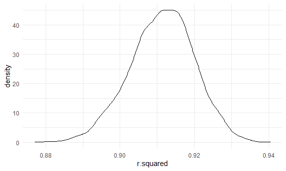
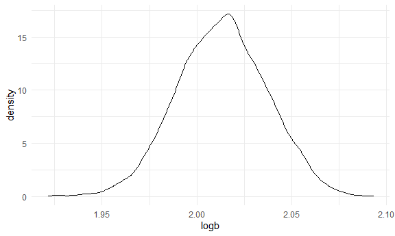

Homework 6
================

## Problem 1

**Reading in the data and cleaning:**

``` r
homicide_df = 
  read_csv("data/homicide-data.csv", na = c("", "NA", "Unknown")) %>% 
  mutate(
    city_state = str_c(city, state, sep = ", "),
    victim_age = as.numeric(victim_age),
    resolution = case_when(
      disposition == "Closed without arrest" ~ 0,
      disposition == "Open/No arrest"        ~ 0,
      disposition == "Closed by arrest"      ~ 1)
  ) %>% 
  filter(
    victim_race %in% c("White", "Black"),
    city_state != "Tulsa, AL") %>% 
  select(city_state, resolution, victim_age, victim_race, victim_sex)
```

**Start with Baltimore, MD:**

``` r
baltimore_df =
  homicide_df %>% 
  filter(city_state == "Baltimore, MD")
glm(resolution ~ victim_age + victim_race + victim_sex, 
    data = baltimore_df,
    family = binomial()) %>% 
  broom::tidy() %>% 
  mutate(
    OR = exp(estimate),
    CI_lower = exp(estimate - 1.96 * std.error),
    CI_upper = exp(estimate + 1.96 * std.error)
  ) %>% 
  select(term, OR, starts_with("CI")) %>% 
  knitr::kable(digits = 3)
```

| term              |    OR | CI\_lower | CI\_upper |
| :---------------- | ----: | --------: | --------: |
| (Intercept)       | 1.363 |     0.975 |     1.907 |
| victim\_age       | 0.993 |     0.987 |     1.000 |
| victim\_raceWhite | 2.320 |     1.648 |     3.268 |
| victim\_sexMale   | 0.426 |     0.325 |     0.558 |

**Apply to all cities:**

``` r
models_results_df = 
  homicide_df %>% 
  nest(data = -city_state) %>% 
  mutate(
    models = 
      map(.x = data, ~glm(resolution ~ victim_age + victim_race + victim_sex, data = .x, family = binomial())),
    results = map(models, broom::tidy)
  ) %>% 
  select(city_state, results) %>% 
  unnest(results) %>% 
  mutate(
    OR = exp(estimate),
    CI_lower = exp(estimate - 1.96 * std.error),
    CI_upper = exp(estimate + 1.96 * std.error)
  ) %>% 
  select(city_state, term, OR, starts_with("CI")) 
```

**Plot of ORs and CIs for each city:**

``` r
models_results_df %>% 
  filter(term == "victim_sexMale") %>% 
  mutate(city_state = fct_reorder(city_state, OR)) %>% 
  ggplot(aes(x = city_state, y = OR)) + 
  geom_point() + 
  geom_errorbar(aes(ymin = CI_lower, ymax = CI_upper)) + 
    theme(axis.text.x = element_text(angle = 90, hjust = 1))
```


## Problem 2

**Reading in data and cleaning it:**

``` r
bwt_df = 
  read_csv("./data/birthweight.csv") %>%
  mutate(
   babysex = as.factor(babysex),
   frace = as.factor(frace),
   malform = as.factor(malform),
   mrace = as.factor(mrace)
  )
```

**Modeling baby’s birthweight**

``` r
model_bwt = lm(bwt ~ wtgain + mheight + gaweeks + ppwt, data = bwt_df)
```

The model above is looking at effect of mother’s weight gain during
pregnancy on baby’s birthweight (in grams), other predictors in the
model based on what likely contributes to baby’s birthweight will be:
mother’s height, gestational age in weeks, and pre-pregnancy weight.

**Plot residuals and fitted values**

``` r
bwt_df %>% 
  add_residuals(model_bwt) %>% 
  add_predictions(model_bwt) %>% 
  ggplot(aes(x = pred, y = resid)) +
  geom_point(alpha = 0.5)
```


The plot above shows the residuals against fitted values, based on this
plot it looks like there are some outliers:

**Comparing model 1 with other 2 models through cross validation**

``` r
model_bwt2 = lm(bwt ~ blength + gaweeks, data = bwt_df)

model_bwt3 = lm(bwt ~ bhead * blength * babysex, data = bwt_df)

cv_df =
  crossv_mc(bwt_df, 100) %>% 
  mutate(
    train = map(train, as_tibble),
    test = map(test, as_tibble))
```

**Obtaining RMSEs**

``` r
cv_df = 
  cv_df %>% 
  mutate(
    model_bwt  = map(train, ~lm(bwt ~ wtgain + mheight + gaweeks + ppwt, data = .x)),
    model_bwt2  = map(train, ~lm(bwt ~ blength + gaweeks, data = .x)),
    model_bwt3  = map(train, ~lm(bwt ~ bhead * blength * babysex, data = .x))) %>% 
  mutate(
    rmse_bwt = map2_dbl(model_bwt, test, ~rmse(model = .x, data = .y)),
    rmse_bwt2 = map2_dbl(model_bwt2, test, ~rmse(model = .x, data = .y)),
    rmse_bwt3 = map2_dbl(model_bwt3, test, ~rmse(model = .x, data = .y)))
```

**Plotting RMSEs**

``` r
cv_df %>% 
  select(starts_with("rmse")) %>% 
  pivot_longer(
    everything(),
    names_to = "model", 
    values_to = "rmse",
    names_prefix = "rmse_") %>% 
  mutate(model = fct_inorder(model)) %>% 
  ggplot(aes(x = model, y = rmse)) + geom_violin()
```



This plot shows the RMSEs across each model, the highest by far is model
1 while model 2 and model 3 are lower. However, model 3 has the lowest
RMSEs suggesting that it is the best model.

## Problem 3

**Read in data:**

``` r
weather_df = 
  rnoaa::meteo_pull_monitors(
    c("USW00094728"),
    var = c("PRCP", "TMIN", "TMAX"), 
    date_min = "2017-01-01",
    date_max = "2017-12-31") %>%
  mutate(
    name = recode(id, USW00094728 = "CentralPark_NY"),
    tmin = tmin / 10,
    tmax = tmax / 10) %>%
  select(name, id, everything())
```

**Produce estimates of r squared and log(beta0 \* beta1):**

``` r
bootstrap_df =
weather_df %>% 
  bootstrap(5000, id = "strap_number") %>% 
  mutate(
    models = map(.x = strap, ~ lm(tmax ~ tmin, data = .x)),
    results = map(models, broom::glance),
    results2 = map(models, broom::tidy)
  ) %>% 
  select(strap_number, results, results2) %>% 
  unnest(results) %>% 
  select(strap_number, r.squared, results2) %>% 
  unnest(results2) %>% 
  select(strap_number, r.squared, term, estimate) %>% 
  pivot_wider(
    names_from = term,
    values_from = estimate
  ) %>% 
  rename(intercept = '(Intercept)') %>% 
  mutate(
    logb = log(intercept * tmin)
  )
```

**Plot the distribution of these estimates:**

``` r
bootstrap_df %>% 
  ggplot(aes(x = r.squared)) +
  geom_density()
```



``` r
bootstrap_df %>% 
  ggplot(aes(x = logb)) +
  geom_density()
```



The first plot shows the distribution of the r-squared values from the
data, it peaks at around 0.91, however there is a little bump at around
0.90. The second plot shows the distribution of log(b0\*b1) values and
peaks around 2.1. Both curves appear to be normally distributed.

**95% CI for r-squared and log(b0 \* b1):**

``` r
bootstrap_df %>% 
  pivot_longer(
    r.squared:logb,
    values_to = "estimate",
    names_to = "term"
  ) %>%
  group_by(term) %>% 
  summarize(
    ci_lower = quantile(estimate, 0.025),
    ci_upper = quantile(estimate, 0.975)
  )
## # A tibble: 4 x 3
##   term      ci_lower ci_upper
##   <chr>        <dbl>    <dbl>
## 1 intercept    6.72     7.72 
## 2 logb         1.97     2.06 
## 3 r.squared    0.894    0.927
## 4 tmin         1.01     1.07
```
