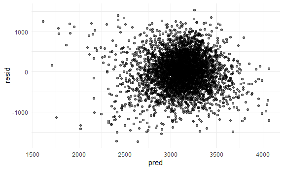

Homework 6
================

## Problem 1

Reading in the data and cleaning:

``` r
homicide_df = 
  read_csv("data/homicide-data.csv", na = c("", "NA", "Unknown")) %>% 
  mutate(
    city_state = str_c(city, state, sep = ", "),
    victim_age = as.numeric(victim_age),
    resolution = case_when(
      disposition == "Closed without arrest" ~ 0,
      disposition == "Open/No arrest"        ~ 0,
      disposition == "Closed by arrest"      ~ 1)
  ) %>% 
  filter(
    victim_race %in% c("White", "Black"),
    city_state != "Tulsa, AL") %>% 
  select(city_state, resolution, victim_age, victim_race, victim_sex)
```

Start with Baltimore, MD:

``` r
baltimore_df =
  homicide_df %>% 
  filter(city_state == "Baltimore, MD")
glm(resolution ~ victim_age + victim_race + victim_sex, 
    data = baltimore_df,
    family = binomial()) %>% 
  broom::tidy() %>% 
  mutate(
    OR = exp(estimate),
    CI_lower = exp(estimate - 1.96 * std.error),
    CI_upper = exp(estimate + 1.96 * std.error)
  ) %>% 
  select(term, OR, starts_with("CI")) %>% 
  knitr::kable(digits = 3)
```

| term              |    OR | CI\_lower | CI\_upper |
| :---------------- | ----: | --------: | --------: |
| (Intercept)       | 1.363 |     0.975 |     1.907 |
| victim\_age       | 0.993 |     0.987 |     1.000 |
| victim\_raceWhite | 2.320 |     1.648 |     3.268 |
| victim\_sexMale   | 0.426 |     0.325 |     0.558 |

Apply to all cities:

``` r
models_results_df = 
  homicide_df %>% 
  nest(data = -city_state) %>% 
  mutate(
    models = 
      map(.x = data, ~glm(resolution ~ victim_age + victim_race + victim_sex, data = .x, family = binomial())),
    results = map(models, broom::tidy)
  ) %>% 
  select(city_state, results) %>% 
  unnest(results) %>% 
  mutate(
    OR = exp(estimate),
    CI_lower = exp(estimate - 1.96 * std.error),
    CI_upper = exp(estimate + 1.96 * std.error)
  ) %>% 
  select(city_state, term, OR, starts_with("CI")) 
```

Plot of ORs and CIs for each city:

``` r
models_results_df %>% 
  filter(term == "victim_sexMale") %>% 
  mutate(city_state = fct_reorder(city_state, OR)) %>% 
  ggplot(aes(x = city_state, y = OR)) + 
  geom_point() + 
  geom_errorbar(aes(ymin = CI_lower, ymax = CI_upper)) + 
    theme(axis.text.x = element_text(angle = 90, hjust = 1))
```


## Problem 2

Reading in data and cleaning it:

``` r
bwt_df = 
  read_csv("./data/birthweight.csv") %>%
  mutate(
   babysex = as.factor(babysex),
   frace = as.factor(frace),
   malform = as.factor(malform),
   mrace = as.factor(mrace)
  )
```

The model below is looking at effect of mother’s weight gain during
pregnancy on baby’s birthweight (in grams), other predictors in the
model based on what likely contributes to baby’s birthweight will be:
mother’s height, gestational age in weeks, and pre-pregnancy weight.

``` r
model_bwt = lm(bwt ~ wtgain + mheight + gaweeks + ppwt, data = bwt_df)
```

Next, we will plot model residuals against fitted values, based on this
plot it looks like there are some outliers:

``` r
bwt_df %>% 
  add_residuals(model_bwt) %>% 
  add_predictions(model_bwt) %>% 
  ggplot(aes(x = pred, y = resid)) +
  geom_point(alpha = 0.5)
```



We will now compare this model with two other models:

``` r
model_bwt2 = lm(bwt ~ blength + gaweeks, data = bwt_df)

model_bwt3 = lm(bwt ~ bhead * blength * babysex, data = bwt_df)
```

We will use cross-validation to compare our first model with the other 2
models:

``` r
cv_df =
  crossv_mc(bwt_df, 100) %>% 
  mutate(
    train = map(train, as_tibble),
    test = map(test, as_tibble))
```

Below, we are obtaining RMSEs:

``` r
cv_df = 
  cv_df %>% 
  mutate(
    model_bwt  = map(train, ~lm(bwt ~ wtgain + mheight + gaweeks + ppwt, data = .x)),
    model_bwt2  = map(train, ~lm(bwt ~ blength + gaweeks, data = .x)),
    model_bwt3  = map(train, ~lm(bwt ~ bhead * blength * babysex, data = .x))) %>% 
  mutate(
    rmse_bwt = map2_dbl(model_bwt, test, ~rmse(model = .x, data = .y)),
    rmse_bwt2 = map2_dbl(model_bwt2, test, ~rmse(model = .x, data = .y)),
    rmse_bwt3 = map2_dbl(model_bwt3, test, ~rmse(model = .x, data = .y)))
```

This plot shows the RMSEs across each model, the highest by far is model
1; model 2 and model 3 are lower. However, model 3 has the lowest RMSEs
suggesting that it is the best model:

``` r
cv_df %>% 
  select(starts_with("rmse")) %>% 
  pivot_longer(
    everything(),
    names_to = "model", 
    values_to = "rmse",
    names_prefix = "rmse_") %>% 
  mutate(model = fct_inorder(model)) %>% 
  ggplot(aes(x = model, y = rmse)) + geom_violin()
```


